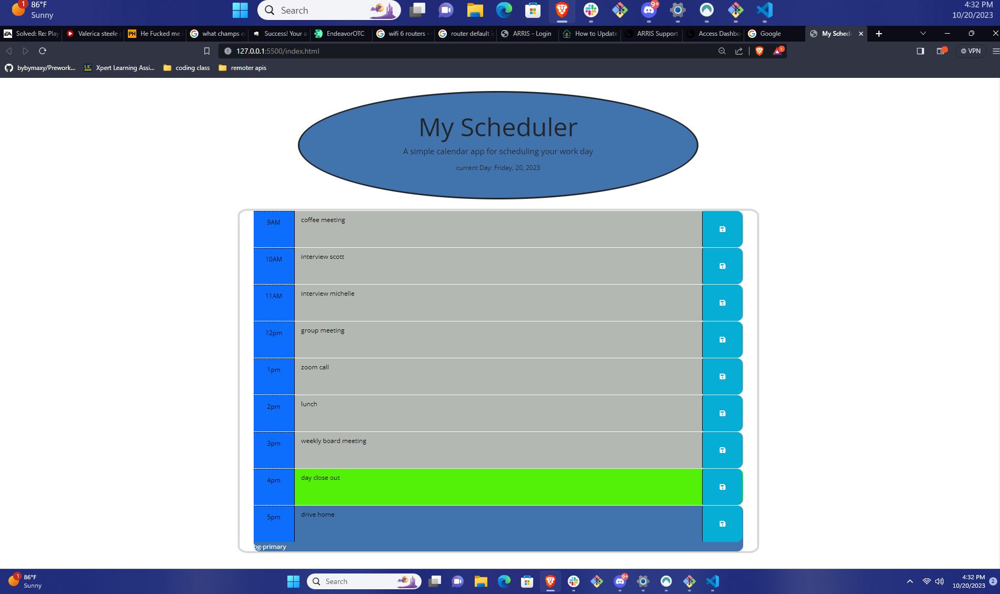
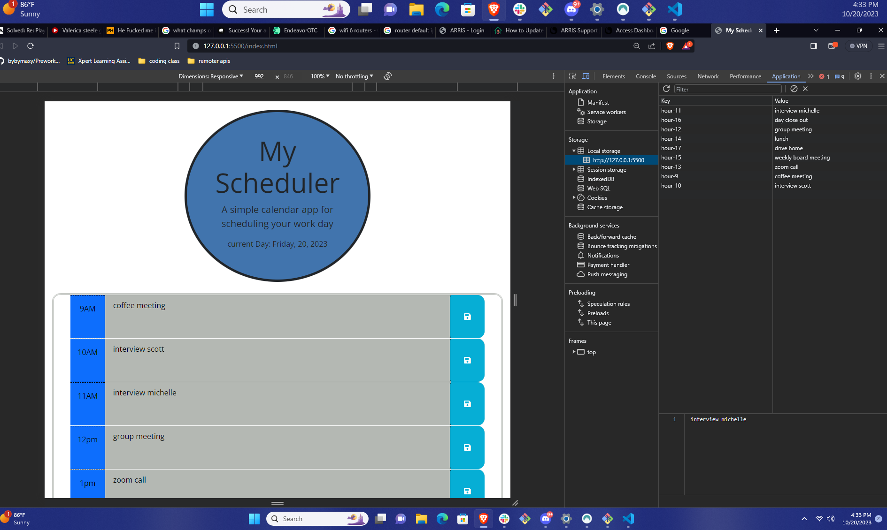

# Title 
My Scheduler

# Description 
I have been tired of trying to save my schedule for class on my phone when i spend most of my time on my pc. To solve this issues i made i scheduler that will remember what i put into it will give me the time of day month and year. It will save all inputs to the console and memory even on page refresh.

## Table of Contents
- [Features](#features)
- [Installation](#installation)
- [Usage](#usage)
- [Contributing](#contributing)
- [License](#license)

## Features

- Feature 1: Saves text inputs to page and console memory.
- Feature 2: Shows you current time day month and year.
- ...

## Installation

Provide instructions on how to install your project. Include any dependencies and step-by-step installation guides if necessary.

# Screenshots 

# Links to browser/github
[github](https://github.com/bybymaxy/MyScheduler)
[live](https://bybymaxy.github.io/MyScheduler/)

